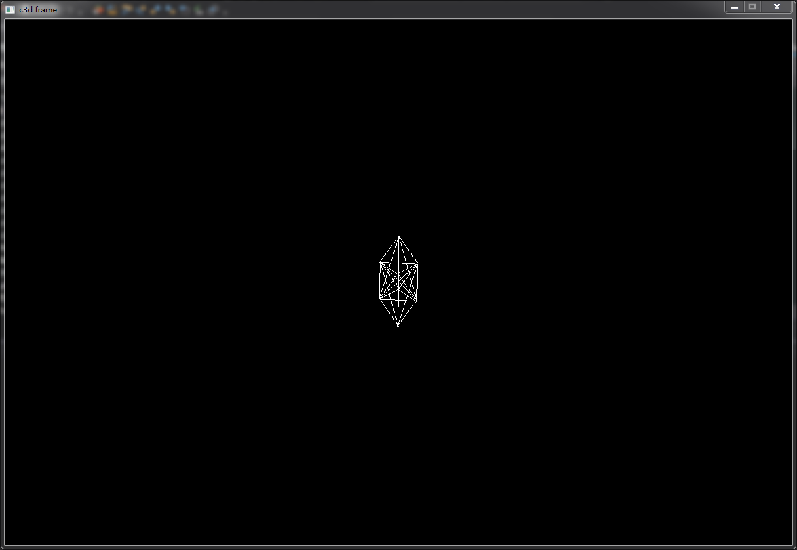

#CPU3D
>####
项目基础用到了glm数学库。
但是本意是想通过使用不同平台实现各自的render，从而实现绘图接口，来保证框架的跨平台
软渲染的实例程序.
...
...
下面会持续更新，大致按一下的步骤来
==============

		0.基础环境框架的搭建
				0.1	无纹理无颜色
				0.2	绘制面的逻辑加颜色
				0.3	加纹理
		1.初步3d模型	(纹理加载有点难度)
		[b]2.光照
		3.天空盒
		4.环境贴图
		5.漫游
		6.虚拟的实现shader	//到时候看吧
========================
>####
		#
======================
		项目使用的环境：
			vs2012(其实代码在其他平台上也可以跑通)。
			